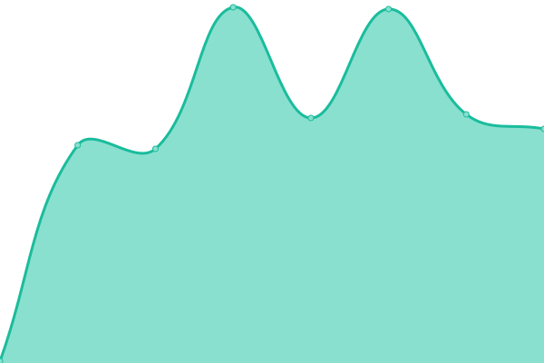

# [📈 Live Status](https://Atarity.github.io/upptime): <!--live status--> **🟩 All systems operational**

This repository contains the open-source uptime monitor and status page for [Mike Sannikov](https://snnkv.com), powered by [Upptime](https://github.com/upptime/upptime).

With [Upptime](https://upptime.js.org), you can get your own unlimited and free uptime monitor and status page, powered entirely by a GitHub repository. We use [Issues](https://github.com/Atarity/upptime/issues) as incident reports, [Actions](https://github.com/Atarity/upptime/actions) as uptime monitors, and [Pages](https://Atarity.github.io/upptime) for the status page.

<!--start: status pages-->
<!-- This summary is generated by Upptime (https://github.com/upptime/upptime) -->
<!-- Do not edit this manually, your changes will be overwritten -->
<!-- prettier-ignore -->
| URL | Status | History | Response Time | Uptime |
| --- | ------ | ------- | ------------- | ------ |
|  [snnkv.com](https://snnkv.com/) | 🟩 Up | [snnkv-com.yml](https://github.com/Atarity/upptime/commits/HEAD/history/snnkv-com.yml) | 

 246ms
     
 | 

<a href="https://Atarity.github.io/upptime/history/snnkv-com">100.00%</a>
    

|  [DIY synths DB](https://diy-synths.snnkv.com/) | 🟩 Up | [diy-synths-db.yml](https://github.com/Atarity/upptime/commits/HEAD/history/diy-synths-db.yml) | 

 167ms
     
 | 

<a href="https://Atarity.github.io/upptime/history/diy-synths-db">100.00%</a>
    

|  [Mademistakes](https://snnkv.com/mademistakes/api/v1.0/issues) | 🟩 Up | [mademistakes.yml](https://github.com/Atarity/upptime/commits/HEAD/history/mademistakes.yml) | 

 142ms
     
 | 

<a href="https://Atarity.github.io/upptime/history/mademistakes">100.00%</a>
    

<!--end: status pages-->

[**Visit status website →**](https://Atarity.github.io/upptime)

## 📄 License

- Powered by: [Upptime](https://github.com/upptime/upptime)
- Code: [MIT](./LICENSE) © [Anand Chowdhary](https://anandchowdhary.com)
- Data in the `./history` directory: [Open Database License](https://opendatacommons.org/licenses/odbl/1-0/)
